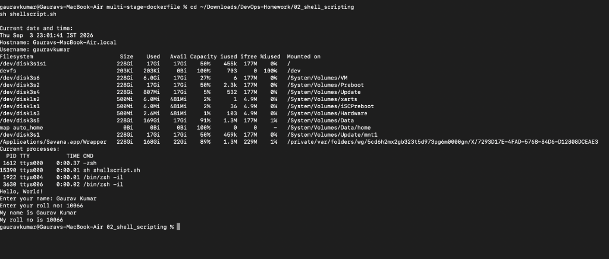

# Task 2: Shell Scripting (System Information Script)

**Name:** Gaurav Kumar  
**Roll No:** 10066  

---

## Script Execution & Output
Ran `shellscript.sh`, which displays system information (current date, hostname, username, disk usage, running processes), prints a message using a variable, prompts for name and roll number using `read -p`, creates file `process.log` with `touch`, and saves running processes using `>` output redirection.

```bash
chmod +x shellscript.sh
sh shellscript.sh
```

### Execution Screenshot:


---

## Observations
- Using variables (`variable="Hello, World!"`) allows storing and outputting string values.
- `read -p` allows capturing user input interactively on the command line.
- The `>` redirection operator sends output into `process.log`, and `>>` appends the `ps` process table into it.
