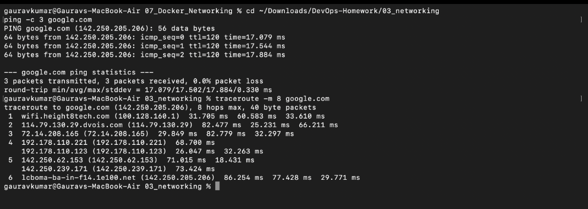
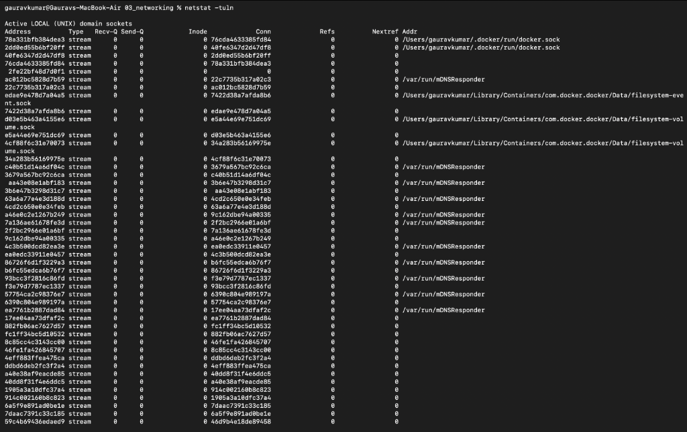
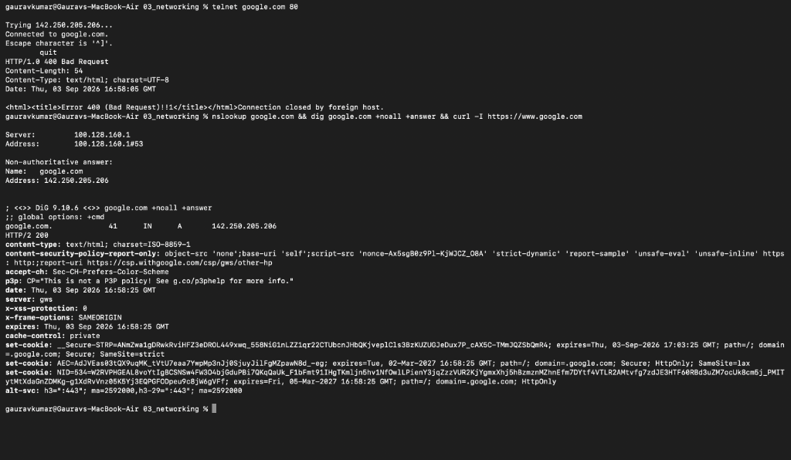

# Networking Commands – Practical Output

**Name:** Gaurav Kumar  
**Roll No:** 10066  

---

## 1. Ping & Traceroute
Testing network reachability and tracing hops to `google.com`:

---

## 2. Netstat
Checking active network sockets and connections on the system:

---

## 3. Telnet, Nslookup, Dig & Curl
Testing TCP port connection (`telnet`), DNS name resolution (`nslookup` & `dig`), and fetching HTTP response headers (`curl`):

