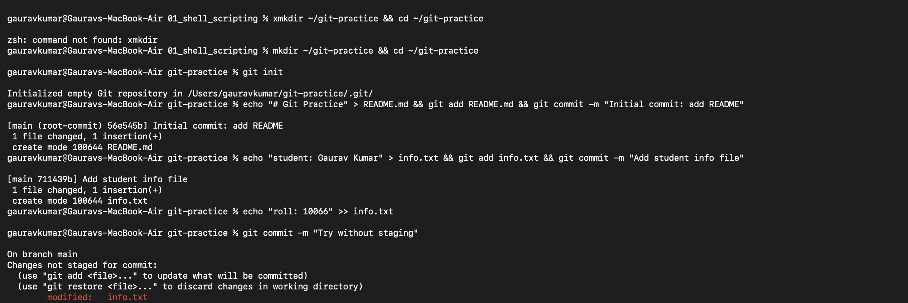
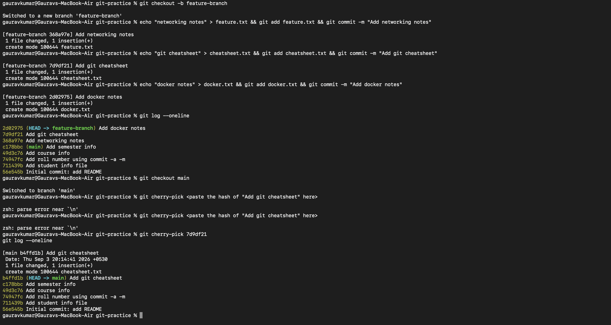

# Git Task

**Name:** Gaurav Kumar  
**Roll No:** 10066  

---

## Task 1 - git commit -m vs git commit -a -m

I tested both commands to see the difference.

First I modified a file without staging it and tried `git commit -m`:



It showed "no changes added to commit" — the commit did not work because I didn't run `git add` before.

Then I used `git commit -a -m` on the same file:


This time it worked. The `-a` flag stages modified files automatically so I didn't need to do `git add` separately.

**Difference:**  
`git commit -m` needs you to manually stage files with `git add` first.  
`git commit -a -m` does the staging on its own for files that are already tracked.

---

## Task 2 - Cherry Pick

I created 4 commits in main, then created a new branch called `feature-branch` and made 3 commits there.

I used `git log --oneline` to find the commit I wanted — "Add git cheatsheet" with hash `7d9df21`.

Then switched back to main and ran:
```
git cherry-pick 7d9df21
```



After cherry-pick the `git log` on main showed the "Add git cheatsheet" commit at the top. The other two commits from feature-branch (networking notes and docker notes) were not there — only the one I picked.

**What I understood:**  
Cherry-pick is useful when you want only one specific commit from another branch, not the whole branch.
