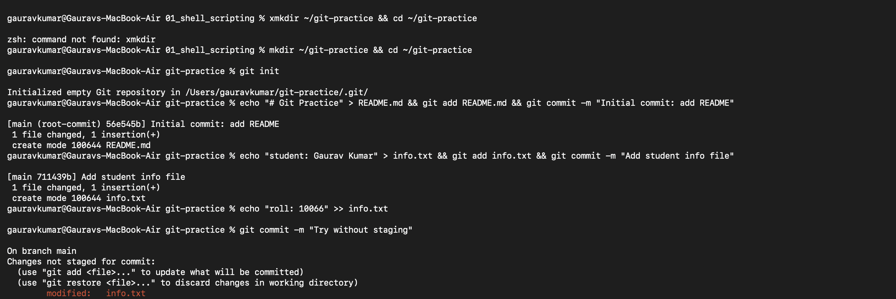
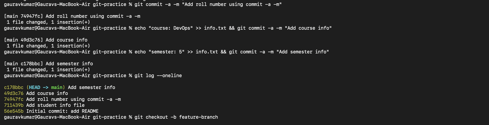
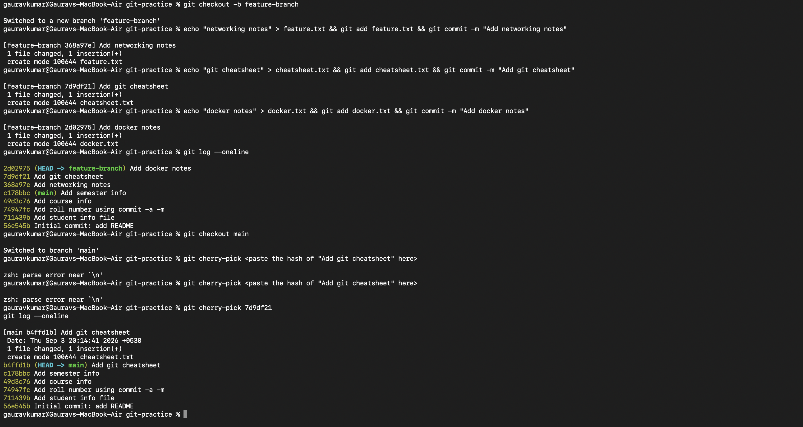

# Git Commands – Practical Output

**Name:** Gaurav Kumar  
**Roll No:** 10066  
**Date:** 03 September 2026  

---

## Task 1: `git commit -m` vs `git commit -a -m`

### Screenshot 1 – Git init, setup commits, and `git commit -m` failing



### Screenshot 2 – `git commit -a -m` success and `git log --oneline` on main



### Setup – Init a practice repo and make the first commit

```
$ git init
Initialized empty Git repository in /private/tmp/git-practice/.git/

$ echo "# Git Practice Repo" > README.md
$ git add README.md
$ git commit -m "Initial commit: add README"
[main (root-commit) 272de1f] Initial commit: add README
 1 file changed, 1 insertion(+)

$ echo "student: Gaurav Kumar" > info.txt
$ git add info.txt
$ git commit -m "Add student info file"
[main 94ef132] Add student info file
 1 file changed, 1 insertion(+)
```

---

### Difference: `git commit -m` vs `git commit -a -m`

**Step 1 – Modify an already-tracked file without staging:**

```
$ echo "roll: 10066" >> info.txt
```

**Step 2 – Try `git commit -m` (without `git add`):**

```
$ git commit -m "Try commit -m without staging (should fail)"

On branch main
Changes not staged for commit:
  (use "git add <file>..." to update what will be committed)
  (use "git restore <file>..." to discard changes in working directory)
        modified:   info.txt

no changes added to commit (use "git add" and/or "git commit -a")
```

**Result:** ❌ Failed — `git commit -m` only commits what is already staged. Since I didn't run `git add`, nothing was committed.

**Step 3 – Use `git commit -a -m` instead:**

```
$ git commit -a -m "Add roll number using commit -a -m (auto-stages tracked files)"
[main 82b2a04] Add roll number using commit -a -m (auto-stages tracked files)
 1 file changed, 1 insertion(+)
```

**Result:** ✅ Success — `-a` automatically stages all **tracked** modified files before committing. No need to run `git add` separately.

### Key Difference

| | `git commit -m` | `git commit -a -m` |
|---|---|---|
| Needs `git add` first? | Yes | No (for tracked files) |
| Works on new untracked files? | N/A (need git add) | No – only tracked files |
| Use case | Fine-grained control | Quick commit of all changes |

---

## Task 2: Git Cherry-Pick

### Step 1 – Add more commits to `main` branch

```
$ echo "course: DevOps" >> info.txt
$ git commit -a -m "Add course info to main"
[main f0ac52f] Add course info to main
 1 file changed, 1 insertion(+)

$ echo "semester: 5" >> info.txt
$ git commit -a -m "Add semester info to main"
[main ab833cf] Add semester info to main
 1 file changed, 1 insertion(+)
```

### Screenshot 3 – feature-branch commits and `git log --oneline`


### Screenshot 4 – Cherry-pick and verification in main



### Step 2 – View commits in main with `git log`

```
$ git log --oneline

ab833cf Add semester info to main
f0ac52f Add course info to main
82b2a04 Add roll number using commit -a -m (auto-stages tracked files)
94ef132 Add student info file
272de1f Initial commit: add README
```

### Step 3 – Create a new branch and make commits

```
$ git checkout -b feature-branch
Switched to a new branch 'feature-branch'

$ echo "feature 1: networking notes" > feature.txt
$ git add feature.txt
$ git commit -m "Add networking notes file"
[feature-branch f648ceb] Add networking notes file
 1 file changed, 1 insertion(+)

$ echo "feature 2: git cheatsheet" > cheatsheet.txt
$ git add cheatsheet.txt
$ git commit -m "Add git cheatsheet"
[feature-branch 0d428f6] Add git cheatsheet
 1 file changed, 1 insertion(+)

$ echo "feature 3: docker notes" > docker.txt
$ git add docker.txt
$ git commit -m "Add docker notes"
[feature-branch 1d9a703] Add docker notes
 1 file changed, 1 insertion(+)
```

### Step 4 – View commits in feature-branch with `git log`

```
$ git log --oneline

1d9a703 Add docker notes
0d428f6 Add git cheatsheet      ← I want to cherry-pick this one
f648ceb Add networking notes file
ab833cf Add semester info to main
f0ac52f Add course info to main
82b2a04 Add roll number using commit -a -m (auto-stages tracked files)
94ef132 Add student info file
272de1f Initial commit: add README
```

### Step 5 – Switch back to main and cherry-pick the specific commit

I want to bring only the `"Add git cheatsheet"` commit (hash `0d428f6`) from `feature-branch` into `main`, without the other two commits.

```
$ git checkout main
Switched to branch 'main'

$ git cherry-pick 0d428f6
[main 5d74ef6] Add git cheatsheet
 Date: Thu Sep 3 20:01:48 2026 +0530
 1 file changed, 1 insertion(+)
 create mode 100644 cheatsheet.txt
```

### Step 6 – Verify the cherry-picked commit is now in main

```
$ git log --oneline

5d74ef6 Add git cheatsheet    ← cherry-picked from feature-branch ✅
ab833cf Add semester info to main
f0ac52f Add course info to main
82b2a04 Add roll number using commit -a -m (auto-stages tracked files)
94ef132 Add student info file
272de1f Initial commit: add README
```

✅ The `"Add git cheatsheet"` commit is now in `main` even though the other two feature-branch commits (`Add networking notes file`, `Add docker notes`) are not. That is exactly what cherry-pick does — it copies one specific commit to another branch.

---


