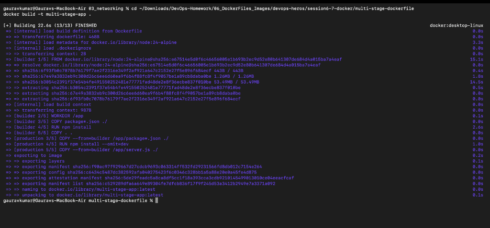
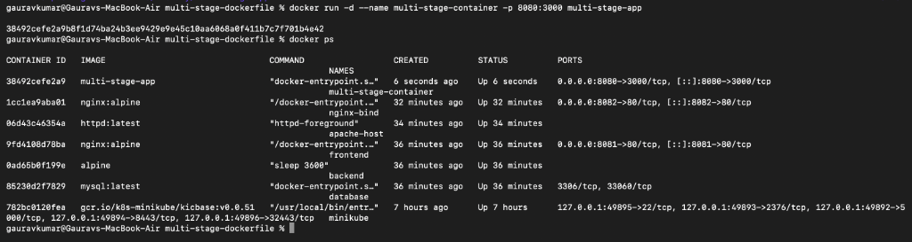
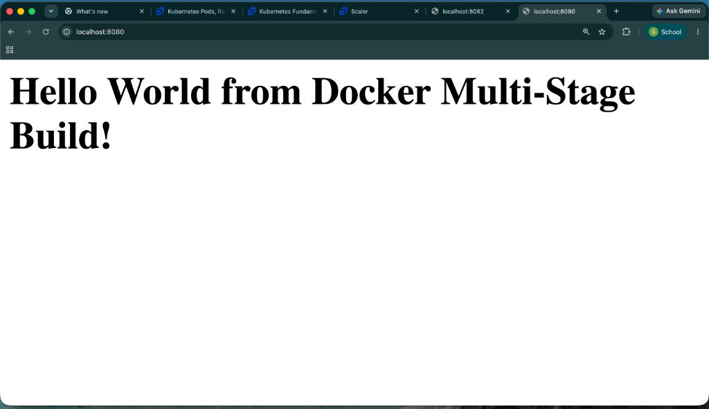

# Docker Multi-Stage Build Homework

## Name
Gaurav Kumar

## Roll No 
10066

---

## Task 1: Multi-Stage Docker Build

### Application Output
Application was successfully accessed at:
[http://localhost:8080](http://localhost:8080/)

Output:
Hello World from Docker Multi-Stage Build!

# Docker terminal logs

# Running locally 

---

## Task 3: Docker Application Deployment
*Note: Deploying 3 different types of applications using Docker (Node.js, Python, Java) has been completed. The code and Dockerfiles are in the `05_docker_fundamentals` folder in this repository.*
